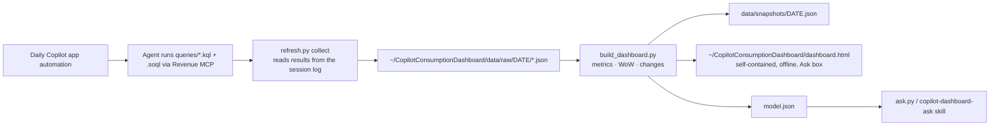

# Copilot Consumption Dashboard

A daily-refreshed, **local-only** dashboard of the Salesforce accounts you own that are actively consuming GitHub Copilot. It shows every available consumption signal and what changed week over week.

> **Privacy:** this repo is public. Only code and query templates live here. Your config, account data and the rendered dashboard live **outside the repo** in `~/CopilotConsumptionDashboard/` (override with the `CCD_HOME` env var), so they can't be committed. That also means every daily run, whatever worktree it lands in, extends the same history.

## What's in it

| Section | Contents |
|---|---|
| **Ask** | A natural-language question box, e.g. *"which accounts are not active this week?"*, *"Red health accounts using Copilot CLI with more than 20 users"*, *"biggest drop in spend"*, *"who renews in 60 days?"*, *"what changed for <account>"*. It runs offline in the page, shows how the question was interpreted, and returns a table you can click into. |
| **Overview KPIs** | Consuming accounts, accounts active this week, weekly/28-day active users, assigned and contracted seats, users at risk, acceptance rate, UBB gross/billable spend, AI units, month-to-date spend with run-rate and projected billable, Copilot billed over the last 12 months, GitHub ARR, health mix. All show WoW deltas and 13-week sparklines. |
| **What changed this week** | New or stopped consumers, active-user swings, seat assignment and contract changes, health category moves, rising users at risk, spend spikes and drops, newly adopted surfaces, pool overage risk, renewals within 90 days with declining usage, low utilisation, and ownership adds/removes. Filterable, and each item links to its account. |
| **Accounts table** | Sortable and searchable, with WoW deltas: health, actives, assigned, utilisation, contracted seats, at risk, 4-week trend, UBB 7d/28d/MTD/run-rate, acceptance, top surface and model, ARR, renewal. CSV export. |
| **Account drill-down** | 13-week charts (actives, seats, health, at risk, spend, AI units, acceptance), contracted seat history, a per-integration/surface table, model mix, risk-factor breakdown, editors, MAU retention (GRR/NRR), pools, billing, pipeline, CSM/CSA. |
| **Portfolio trends** | Active users, active accounts, spend, spend stacked by surface, AI units, acceptance, surface adoption table, model mix. |
| **Not yet consuming** | Owned accounts with no Copilot signal, ranked by GHE seats and ARR. These are whitespace. |
| **Usage on unowned accounts** | Copilot usage on Salesforce accounts with no real owner (for example auto-created by Data Syncer from a GitHub enterprise slug) whose name matches an account you own. It shows in the account's detail and in What changed so you can get it merged. It isn't added to totals. |
| **Data notes** | Definitions, per-source freshness and row counts, and caveats. |

**Consuming** means any Copilot active users, seats assigned, or usage-based-billing (UBB) spend in the last 90 days, or Copilot billed last month. Accounts billed with no usage telemetry are flagged *usage not linked*, which usually means their usage is attributed to another account or enterprise. **Scope** is accounts where you are the Salesforce Account Owner.

## How it works



- The queries in `queries/` are the versioned source of truth. `{{OWNER_ID}}` and `{{OWNER_NAME}}` come from your config.
- **WoW** compares the latest 7 days with the 7 before, using daily facts, so it works from the first run. Ownership changes compare with the saved snapshot closest to 7 days earlier.
- The dashboard is a single HTML file with inline JS/SVG, no network calls and no CDN.

## Asking questions

There are two ways to ask questions, and both answer **only from the dashboard's data**, so the answers always match the page.

1. **The Ask box** on the dashboard is a rule-based parser (`ask_engine.js`, inlined at build time). It handles filters (activity, health, surfaces, models, region/segment, renewals, utilisation, numeric thresholds), WoW changes, top/bottom-N rankings, counts/totals/averages, account lookups, and model/surface breakdowns. Filters can be combined. Press `/` to focus. Questions are shareable via `dashboard.html#ask=<question>`.
2. **Copilot chat** handles anything the box can't parse. Click **Copy for Copilot** and paste the text into Copilot chat. The `copilot-dashboard-ask` skill answers with read-only SQL over the same model via `ask.py`:
   ```bash
   python3 ask.py schema                       # tables, columns and shared definitions
   python3 ask.py sql "SELECT name, active_7d FROM accounts WHERE inactive_this_week = 1"
   python3 ask.py install-skill                # (re)install the skill into ~/.copilot/skills/
   ```

Shared definitions such as *active this week*, *inactive*, *declining* and *low utilisation* are computed once in `build_dashboard.py` (`add_flags`) and used by the page, the Ask box and `ask.py`. The builder also writes the full model to `~/CopilotConsumptionDashboard/model.json` for `ask.py`.

Tests: `node tests/test_ask_engine.js` (synthetic data; when a local `model.json` exists it also checks the Ask box agrees with the shared flags).

## Setup

1. `mkdir -p ~/CopilotConsumptionDashboard && cp config.example.json ~/CopilotConsumptionDashboard/config.json`, then fill in your Salesforce User Id (`005…`) and your name exactly as it appears as account owner. `data_dir` is optional. A `config.local.json` next to the scripts also works.
2. Make sure the **revenue-mcp-server** MCP is connected in the Copilot app.
3. Ask Copilot to *"Follow copilot-consumption-dashboard/REFRESH.md"*, or create a daily automation with that prompt.
4. Open `~/CopilotConsumptionDashboard/dashboard.html`.
5. Optional: run `python3 ask.py install-skill` to enable chat questions.

Requires Python 3.9+ (stdlib only). Node is needed only to run the tests.

## Data sources and caveats

- **rev_source:** daily Copilot health score, daily UBB burn rate, UBB revenue by integration/model, monthly product ARR and seats.
- **c360 (experimental):** account entity (ARR, billing, renewal, CSM), seat/engagement snapshot, IDE telemetry, MAU retention.
- **Salesforce:** owned accounts. This is the source of truth for ownership. Accounts attributed to you in the warehouse but not owned in Salesforce are listed separately.
- UBB dollars are **usage-side** list value, not invoiced revenue. "Billable" is usage beyond included pools.
- Copilot product lines carry seats but $0 ARR in the product ARR fact, so ARR shown is the account's total GitHub ARR.
